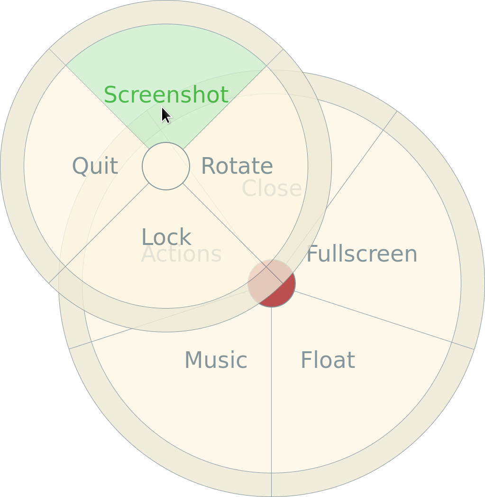

# Pye-Menu
Simple Python3 radial (pie) menu using GTK3 (via GObjectIntrospection)

Depends on pycairo, pygobject3, gtk3-x11 and gobject-introspection.
There is a default.nix so that you can use it from Nix;

Currently, install dependencies
(e.g. if you are on nix, just execute `nix-shell` in the top-level
directory.) Then run `python3 src/pye_menu_shell` to try it out. The
file `src/pye_menu.py` is a python library, and the `src/pye_menu_shell`
is the bash-compatible wrapper for it. It prints the label of the
selected item by default, but you can use `sel:label` which has `label`
visible, and when selected prints `sel`.

An example of use as a python library is the `examples/pen_menu` file,
with a screenshot below:

I use this to get stuff done when using the touchscreen stylus/pen,
without needing to rotate the tablet and switch to using the keyboard.
