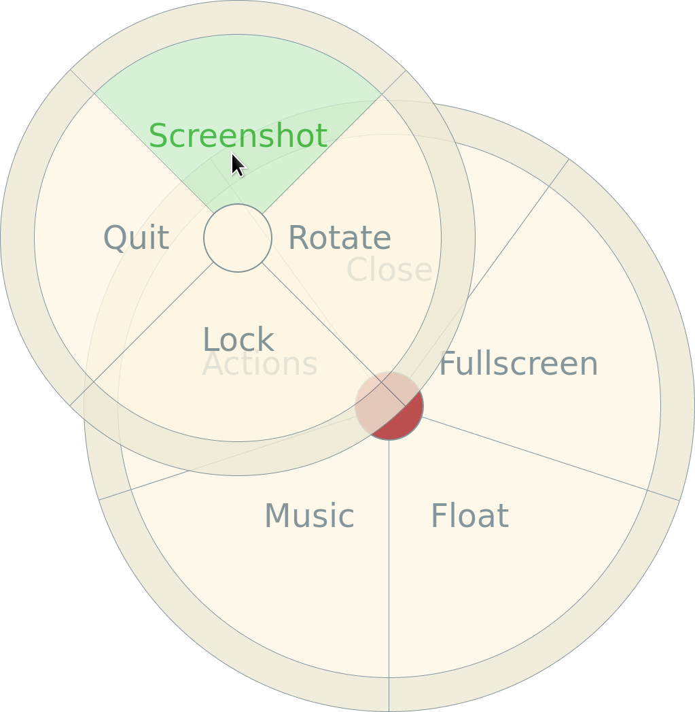

# Pye-Menu
Simple Python3 radial (pie) menu using GTK3 (via GObjectIntrospection)

Depends on pycairo, pygobject3, gtk3-x11 and gobject-introspection.
There is a shell.nix so that you can use it from Nix;
I might make it a package at some point.

Currently, install dependencies
(e.g. if you are on nix, just execute `nix-shell` in the top-level
directory.) Then run `python3 pye_menu_shell.py` to try it out. The
file `pye_menu.py` is a python 'library', and the `pye_menu_shell`
is the bash-compatible wrapper for it. It prints the label of the
selected item by default, but you can use `sel:label` which has `label`
visible, and when selected prints `sel`.

An example of use as a python library is the `wacom_menu` file, with a
screenshot below:

